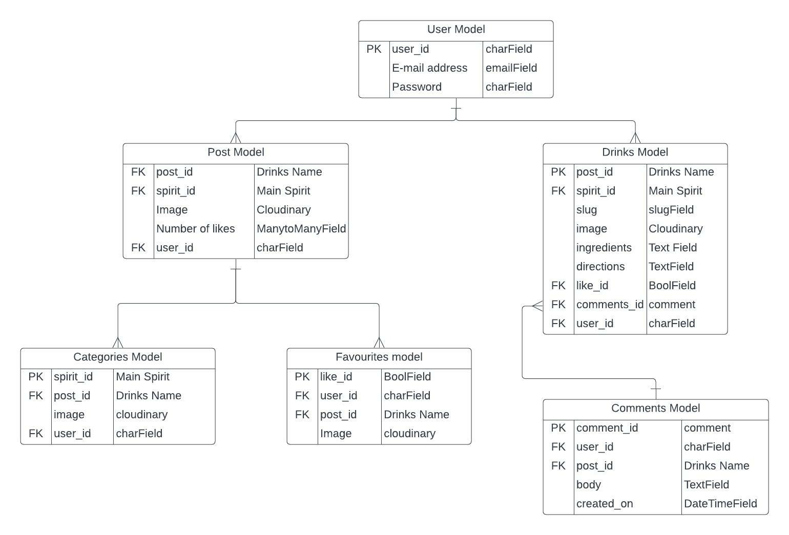

<h1>Cocktailz<h1>
<h2>About the website</h2>

link to deployed site

Am i Responsive images

<h3>Target Audience</h3>

18 and over

<h1>User Stories</h1>

<li>
    <ul>As a admin/user I can view my liked posts on a different page so that I can see which are my favourites drinks</ul>
    <ul>As a admin/user I can manage my post so that if I made a mistake and can change it and update it</ul>
    <ul>As a user I can view a post so that I can see the content of the drinks, likes and comment section</ul>
    <ul>As a user I can comment on a post so that I can be involved in the conversation</ul>
    <ul>As a user I can like and unlike a post so that interact with the content</ul>
    <ul>As a user I can save a draft so that I can finish adding my drink to the site</ul>
    <ul>As a user I can view paginated list of posts so that I can have a list of all the items and view them easily</ul>
    <ul>As a user I can create an account so that I can add drinks, like and comment on other people posts</ul>
    <ul>As a user I can see how may likes/dislikes there are for a drink so that I can see which is more popular or which is the least</ul>
    <ul>As the admin I can approve of user comments so that only positive comments are uploaded into the site, this approval will just be for posts that do not belong to the user</ul>
    <ul>As a admin I can approve which drinks are added into the website so that there is interactivity between myself and users and so that I can make sure there are not any duplicates or just mixed drinks</ul>
    <ul>As a user I can add my own drink if it isn't there already so that people will be able to explore more cocktails</ul>
    <ul></ul>
</li>

<h2>Structure</h2>
<ul>
    <li>base.html</li>
    <li>index.html</li>
    <li>explore.html</li>
    <li>drinks_detail.html</li>
    <li>add_drinks.html</li>
    <li>drinks_favourites.html</li>
    <h3>accounts</h3>
    <li>signup.html</li>
    <li>login.html</li>
    <li>logout.html</li>
</ul>

<h2>Wireframes</h2>

insert images of wireframes for each size

<h1>Data Model</h1>

<h2>Colours</h2>

<h2>Typegraphy</h2>

fonts

font awesome icons

<h2>Features</h2>

index page gives a small intro to webpage, eye catching when users first land on it, register and sign in button for users that need to log in or need to register and account

Dissapears when users log in

explore page contains a list of all the drinks that have been posted, with the name of the drink, spirit, author name and when it was displayed, likes and comments

register page

login page

logout page

favourites page

<h2>Languages</h2>

Python

HTML

CSS

Javascript

<h2>Technologies</h2>

Django

Github

Gitpod

Heroku

Stack Overflow

Balsamiq

Pep8

Cloudinary

PostgrelSQL

Bootstrap

<h2>Testing, bugs and fixed</h2>

Testing

pep8 all files

HTML validator

CSS validator

<h3>Manuel testing</h3>

Solved Bugs

Unsolved Bugs

<h2>Deployment</h2>

<h3>Creating the enviroment</h3>

<h2>Credits</h2>

Future features, drafts, virgin cocktails, category
